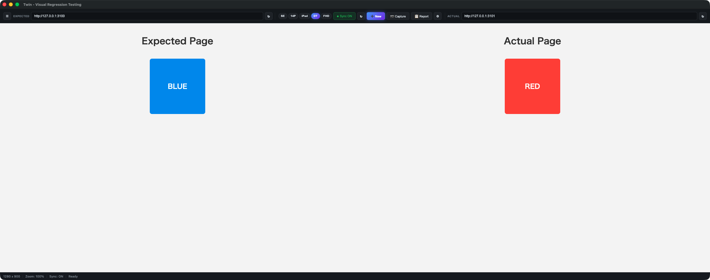
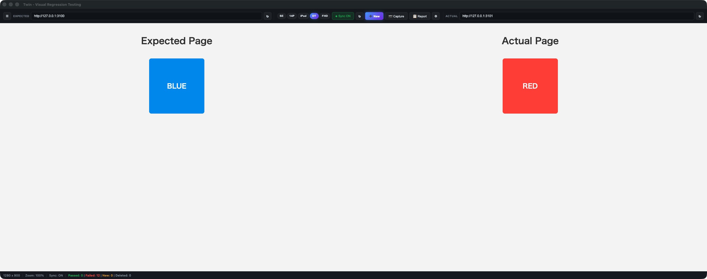
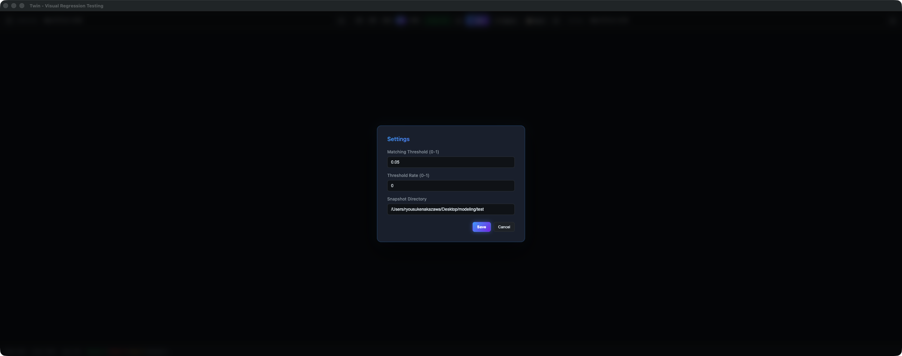
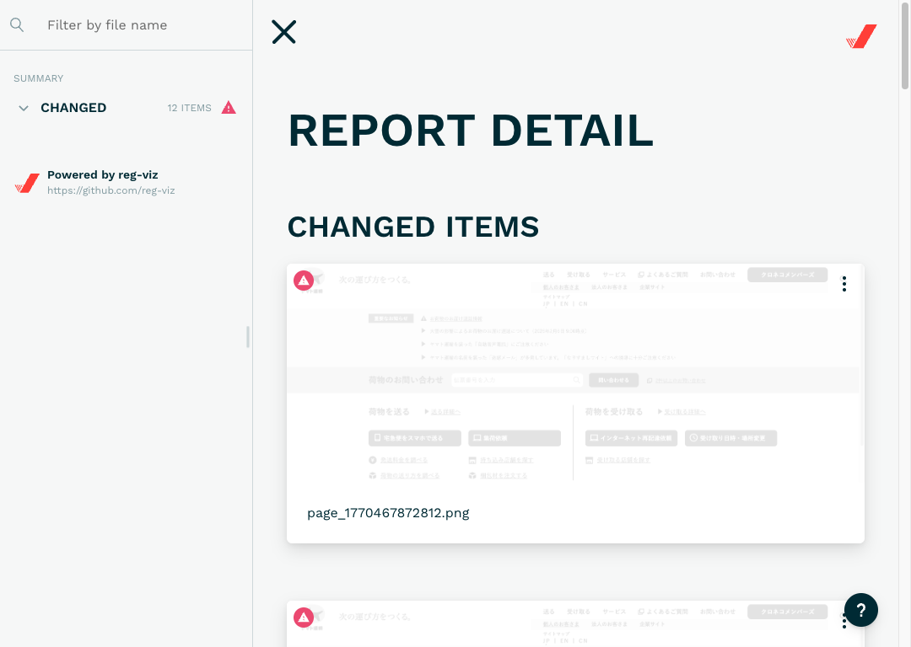
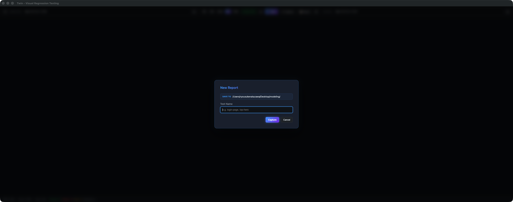

<p align="center">
  
</p>

<h1 align="center">Twin</h1>

<p align="center">
  <strong>Visual Regression Testing Desktop App</strong><br />
  2つの Web ページを左右に並べて表示・同期操作し、スクリーンショット比較で視覚的な差分を検出する Electron 製デスクトップアプリ
</p>

<p align="center">
  <a href="https://github.com/negi1232/Twin/actions/workflows/ci.yml"></a>
  
  
  <a href="LICENSE"></a>
</p>

---

## Overview

Twin は、**Expected（期待値）** と **Actual（実際）** の2つの Web ページを左右に並べて同時に表示・操作し、ワンクリックでスクリーンショットの差分を検出できるデスクトップアプリです。

localhost の開発サーバーでもリモート URL でも使えるため、ブランチ間のビジュアルリグレッションテストに最適です。

## Features

| 機能 | 説明 |
|---|---|
| **Dual Viewer** | 左右2画面で新旧ページを同時表示 |
| **Sync Mode** | スクロール・クリック・キー入力・ページ遷移を左→右に自動同期 |
| **One-click Capture** | スクリーンショット撮影 → reg-cli で差分検出 → HTML レポート生成 |
| **Device Presets** | iPhone SE / 14 Pro / iPad / Desktop / Full HD をワンクリック切替 |
| **Rich Report** | reg-cli のリッチな HTML レポート（透明度スライダー・スワイプ比較・差分ハイライト） |
| **File Browser** | サイドバーでフォルダをツリー表示。ソート・フィルタ・キーボード操作対応 |
| **IME Support** | 日本語入力（変換確定）を値ベースで正確に同期 |
| **Persistent Settings** | URL・閾値・スナップショット保存先を自動保存 |

## Screenshots

<table>
  <tr>
    <td align="center"><strong>メイン画面</strong></td>
    <td align="center"><strong>キャプチャ結果</strong></td>
  </tr>
  <tr>
    <td></td>
    <td></td>
  </tr>
  <tr>
    <td align="center"><strong>サイドバー</strong></td>
    <td align="center"><strong>設定モーダル</strong></td>
  </tr>
  <tr>
    <td></td>
    <td></td>
  </tr>
  <tr>
    <td align="center" colspan="2"><strong>reg-cli レポート</strong></td>
  </tr>
  <tr>
    <td colspan="2" align="center"></td>
  </tr>
</table>

## Getting Started

### Prerequisites

- **Node.js** 18+
- **macOS** 12+ or **Windows** 10+

### Install

```bash
git clone https://github.com/negi1232/Twin.git
cd Twin
npm install
```

### Launch

```bash
npm start          # アプリを起動
npm run dev        # DevTools 付きで起動
```

## Usage

### 基本フロー

```
1. URL を入力        2. プリセット選択      3. Capture で比較
┌──────────────┐    ┌──────────────┐    ┌──────────────┐
│ Expected URL │    │ SE 14P iPad  │    │  📷 Capture  │
│ Actual   URL │    │ DT FHD       │    │              │
└──────────────┘    └──────────────┘    └──────────────┘
                                              │
4. 結果をステータスバーで確認          5. Report で詳細表示
┌─────────────────────────┐    ┌──────────────┐
│ Passed: 3 | Failed: 1  │    │  📋 Report   │
└─────────────────────────┘    └──────────────┘
```

1. **Expected**（左）と **Actual**（右）の URL を入力して Enter
2. デバイスプリセット（**SE** / **14P** / **iPad** / **DT** / **FHD**）でビューサイズを選択
3. **Capture** ボタンでスクリーンショット撮影 & reg-cli 比較を実行
4. ステータスバーに **Passed / Failed / New / Deleted** の結果サマリが表示される
5. **Report** ボタンで reg-cli の HTML レポートを別ウィンドウで確認

### New Report

**+ New** ボタンからテスト名を付けてキャプチャ。ページごとに名前を分けて管理できます。



### File Browser (Sidebar)

ツールバー左端の **☰** ボタンでサイドバーを開閉。

- **Open Folder** — ネイティブダイアログでフォルダを選択し、ツリー表示
- **Sort** — 名前昇順・降順・タイプ別でソート
- **Filter** — 全て / ディレクトリのみ / ファイルのみ
- **Keyboard** — Tab でフォーカス移動、Enter / Space でフォルダ展開・折りたたみ
- フォルダ選択時にスナップショット保存先が自動設定されます

### Sync Mode

**Sync ON/OFF** トグルで操作同期を切替。ON の状態では左画面の操作が右画面に自動反映されます。

| 同期される操作 |
|---|
| スクロール（垂直・水平） |
| マウスクリック |
| キーボード入力 |
| フォーム入力（IME 対応） |
| ページ遷移 |

## Keyboard Shortcuts

| Shortcut | Action |
|---|---|
| `Cmd/Ctrl + R` | 左右両方をリロード |
| `Cmd/Ctrl + Shift + R` | アクティブ側のみリロード |
| `Cmd/Ctrl + Shift + S` | スクリーンショット撮影 & 比較 |
| `Cmd/Ctrl + Shift + O` | 最新レポートを開く |
| `Cmd/Ctrl + 1` ~ `5` | デバイスプリセット切替 (SE / 14P / iPad / DT / FHD) |
| `Cmd/Ctrl + +` | ズームイン |
| `Cmd/Ctrl + -` | ズームアウト |
| `Cmd/Ctrl + 0` | ズームリセット (100%) |
| `Cmd/Ctrl + ,` | 設定モーダルを開く |

## Settings

設定モーダル（`Cmd/Ctrl + ,`）から変更可能。値は自動保存されます。

| Setting | Description | Default |
|---|---|---|
| **Matching Threshold** | ピクセル差分の感度 (0〜1, 小さいほど厳密) | `0` |
| **Threshold Rate** | 変更検知率のしきい値 (0〜1) | `0` |
| **Snapshot Directory** | スクリーンショットの保存先パス | `./snapshots` |

## Development

### Commands

```bash
npm test           # Unit / Integration テスト + カバレッジ
npm run test:watch # ウォッチモード
npm run test:e2e   # E2E テスト (Playwright + Electron)
npm run lint       # ESLint
npm run build:mac  # macOS ビルド (.dmg)
npm run build:win  # Windows ビルド (.exe)
```

### Test Coverage

テストカバレッジの閾値は CI で強制されます。

| Metric | Threshold |
|---|---|
| Statements | 95% |
| Branches | 85% |
| Functions | 85% |
| Lines | 95% |

```
__tests__/
├── unit/           # ユニットテスト (Jest)
├── integration/    # 統合テスト (Jest + mocked IPC)
├── e2e/            # E2E テスト (Playwright + Electron)
└── fixtures/       # テスト用モックサーバー・画像
```

### Tech Stack

| Technology | Purpose |
|---|---|
| [Electron](https://www.electronjs.org/) 40 | Desktop app framework (Chromium + Node.js) |
| [reg-cli](https://github.com/reg-viz/reg-cli) | Image diff & HTML report generation |
| [electron-store](https://github.com/sindresorhus/electron-store) | Persistent JSON settings |
| [Jest](https://jestjs.io/) | Unit & integration tests |
| [Playwright](https://playwright.dev/) | E2E tests (Electron mode) |
| [ESLint](https://eslint.org/) 9 | Linter (flat config) |
| [Husky](https://typicode.github.io/husky/) | Git hooks (pre-commit, pre-push) |
| [electron-builder](https://www.electron.build/) | Cross-platform packaging |
| [GitHub Actions](https://github.com/features/actions) | CI/CD |

### Architecture

```
src/
├── main/                # Electron Main Process
│   ├── index.js         # Entry point — BrowserWindow / WebContentsView
│   ├── ipc-handlers.js  # IPC message handlers
│   ├── sync-manager.js  # Scroll / click / key / form sync
│   ├── screenshot.js    # capturePage() wrapper
│   ├── reg-runner.js    # reg-cli execution & result parsing
│   ├── preload.js       # contextBridge API exposure
│   └── store.js         # electron-store settings manager
├── renderer/            # Renderer Process (browser-safe)
│   ├── index.html
│   ├── styles/main.css
│   └── scripts/
│       ├── app.js              # Main app controller
│       ├── ui-controls.js      # Toolbar & modal interactions
│       ├── sync.js             # Sync toggle UI
│       └── device-presets.js   # Device size presets
└── shared/
    └── constants.js     # Shared constants
```

### Git Workflow

[Git Flow](https://nvie.com/posts/a-successful-git-branching-model/) ベースの PR 駆動ワークフロー:

```
main ──────●──────────●──────────●──── (production releases)
           ↑          ↑          ↑
           │  hotfix/* │ release/*│
           │          │          │
develop ───┴──────────┴──────────┴──── (integration)
            ↑   ↑   ↑
     feature/*  feature/*  feature/*
```

| Branch | Purpose |
|---|---|
| `main` | Production-ready releases |
| `develop` | Integration branch |
| `feature/*` | New features (from develop) |
| `release/*` | Release preparation (from develop) |
| `hotfix/*` | Emergency fixes (from main) |

## License

[MIT](LICENSE)
